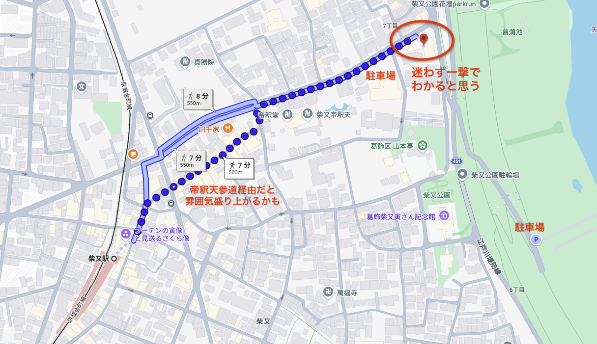
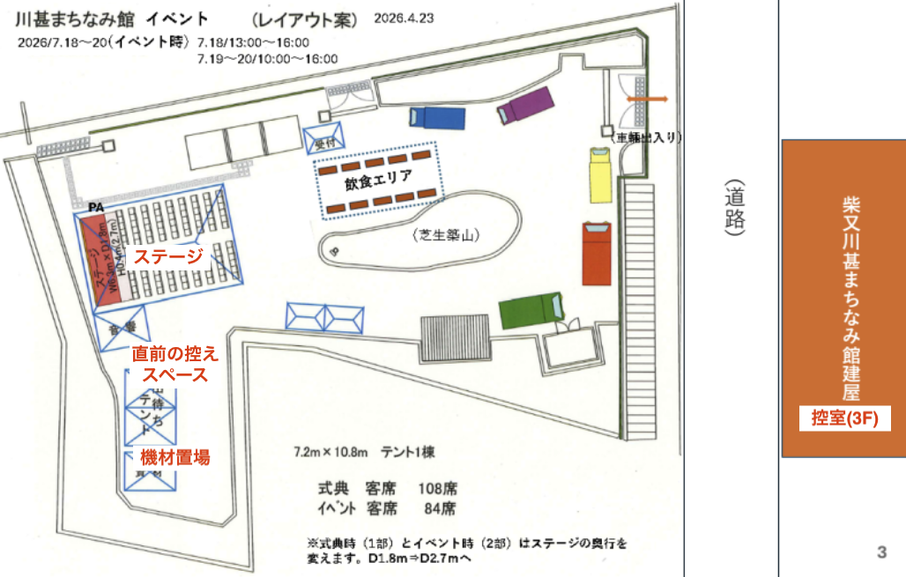

## 東京下町Big Band　- 柴又川甚まちなみ館開館　イベント出演

### 集合場所/集合時間
* 柴又川甚まちなみ館・3F控室
  * https://maps.app.goo.gl/4DXayU2VcRxxCMZf8
* 集合時間: 7月18日（土) **14:30 (搬入関係者は12:00)**

### タイムテーブル
| 時間 | 内容 |
| --- | --- |
| 12:00 | 搬入関係者集合/搬入開始 |
| 14:30 | 全員集合 |
| 15:00 - 15:30 | ステージ設定 |
| **15:30 - 16:00** | **本番演奏** |
| 16:00 - 17:00 | 撤収 |

### 持ちもの
* 楽器、譜面等演奏に必要な機材
* **譜面台** (５台)
   
### 服装
* 上は白系、下は黒or紺色
* アクセサリーなど「ワンポイント」があると嬉しい
* それ以外は自由

### 当日の連絡先
* 090-6526-0057 荻原

### メンバー/パート(敬称略)

| 氏名 | パート | 備考 |
| --- | --- | --- |
| 宮田 | Vocal |  |
| 坂本 | Piano |  |
| 居村 | Poano |  |
| 三國 | A.Sax |  |
| 塚本 | T.Sax |  |
| 岡田 | B.Sax |  |
| 藤山 | Drums |  |
| 池上 | Bass |  |
| 守田 | Trombone | Extra |
| 荻原 | Trumpet |  |

### 演奏曲

| 曲名 | 想定演奏時間 |
| --- | --- |
| Oleo | 3:00 |
| Darn that dream | 5:00 |
| Red Clay | 5:00 |
| Nearness of you(Vo) | 5:00 |
| Almost like being in love(Vo) | 2:30 |
| L-O-V-E (Encore)(Vo) | 2:30 |

### MC
* Red Clay - Vocal登場までは荻原、以降は宮田さん

### 補足
* 出演者全員分のお弁当の用意あり
* 交通費を含む出演料は「各自」受け取ること
* 暑さ対策を十分にお願いします

### マップ

|  |  |
| --- | --- |
|  |  |

